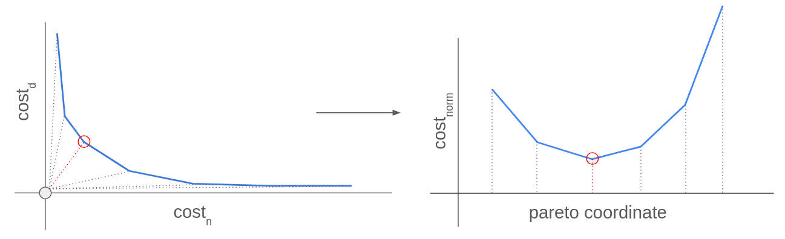

# multiobjective_optimization
A simple demo of the use of the square distance metric to jointly minimize 2 objectives in an Integer Linear Programming problem using [or-tools](https://github.com/google/or-tools). Based loosely on the concepts presented in this [paper](https://www.eng.buffalo.edu/Research/DOES/administrator/components/com_jresearch/files/publications/SMO-01-EK.pdf)

#### Background
A problem with competing objectives, such as clustering, involves two criteria which cannot be independently optimized without penalizing the score of each other.



The solution presented here finds the independent objective minima and then finds a solution which jointly minimizes the distance in 2D space from the (min_1,min_2) "utopia" point. 

For this demonstration, an extension of the clustering problem is presented, where the goal is to select a subset of "representative" datapoints to cover all points in the dataset with minimal distance.

## Building

At the moment this project is implemented in C++ and uses CMake to fetch and build or-tools from source. 
```
git clone https://github.com/rlorigro/multiobjective_optimization
cd multiobjective_optimization
mkdir build
cd build
cmake ..
make -j [n_threads]
```

## Usage

The demo only takes one optional argument, which is the seed used to generate a random dataset with 3 clusters in 2D space.
```
./demo [seed]
```

This will produce the following output files in the working directory:

CSVs corresponding to the independent and joint solutions:
```
edges_n.csv
edges_d.csv
edges_n_d.csv
nodes_n.csv
nodes_d.csv
nodes_n_d.csv
```

Simple PPM plots corresponding to the indpendent and joint solutions:
```
input_n.ppm
input_d.ppm
input_n_d.ppm
result_n.ppm
result_d.ppm
result_n_d.ppm
```

If you want to make a nicer plot (see example output), you can use the included python script:
```
python3 scripts/plot_results.py -n ./nodes_n_d.csv -e ./edges_n_d.csv
```

## Background

### Data generation

Clusters are simulated using randomly centered normal distributions in 2D:

For each cluster $ i = 0, 1, \ldots, n-1 $:

1. Sample a random cluster center:

   $$
   x_{\text{offset}}, y_{\text{offset}} \sim \mathcal{U}(v_{\text{min}}+1, v_{\text{max}}-1)
   $$
   
2. For each of the $ n_{\text{samples}} $ points:
    - Sample from a Gaussian distribution:

      $$
      x = x_{\text{offset}} + \epsilon_x, \quad \epsilon_x \sim \mathcal{N}(0, \sigma^2)
      $$

      $$
      y = y_{\text{offset}} + \epsilon_y, \quad \epsilon_y \sim \mathcal{N}(0, \sigma^2)
      $$


Then the optimizer jointly minimizes `n` and `d` to find representative data points.

n = number of representatives (clusters)

d = total distance of representative to their constituents 

### Details of clustering model

Let $ N $ be the number of nodes, each with coordinates $ \textbf{coords}[i] = (x_i, y_i) $. Define:

- $ P_i \in \{0, 1\} $: Boolean variable indicating whether node $ i $ is a parent node.
- $ E_{i,j} \in \{0, 1\} $: Boolean variable indicating whether there is a directed edge from node $ i $ to node $ j $.
- $ d_{i,j} $: Edge cost, defined as the Euclidean distance between nodes $ i $ and $ j $, scaled and rounded to 1 decimal of precision:
  
  $$
  d_{i,j} = \left\lfloor 10 \cdot \sqrt{(x_i - x_j)^2 + (y_i - y_j)^2} + 0.5 \right\rfloor
  $$

#### Objective

Two cost variables are accumulated:

- Number of parent nodes:

  $$
  \text{cost}_n = \sum_{i=0}^{N-1} P_i
  $$

- Total edge cost:

  $$
  \text{cost}_d = \sum_{\substack{i=0 \\ j \neq i}}^{N-1} d_{i,j} \cdot E_{i,j}
  $$

The joint objective is equivalent to minimizing the L2 norm:

$$
\text{Minimize } \left\| \left( \frac{n - n_{\min}}{n_{\text{range}}}, \frac{d - d_{\min}}{d_{\text{range}}} \right) \right\|_2^2
$$

where 

$$
n_{\text{range}} = n_{\max} - n_{\min}
$$

$$
d_{\text{range}} = d_{\max} - d_{\min}
$$

#### Constraints

_see code for details_

## Results

Figures are plotted as follows:
- Larger dots are representatives (parent nodes)
- Smaller dots are constituents (child nodes)
- Lines show which points are constituents of a representative
- Colors correspond to clusters

### Min(d) solution
When **distance** is minimized independently, the model chooses almost the maximum number of representatives possible. Only several representatives have more than one child node.


### Min(n) solution
When **number of representatives** is minimized independently, the model selects only one representative.


### Joint solution
Jointly minimizing the distance from (n_min,d_min) yields a meaningful result which recreates the true clusters.


