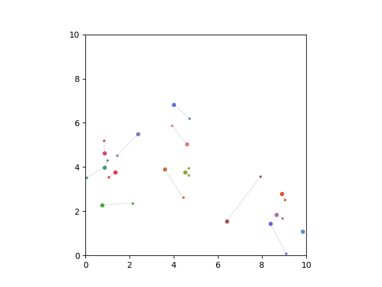
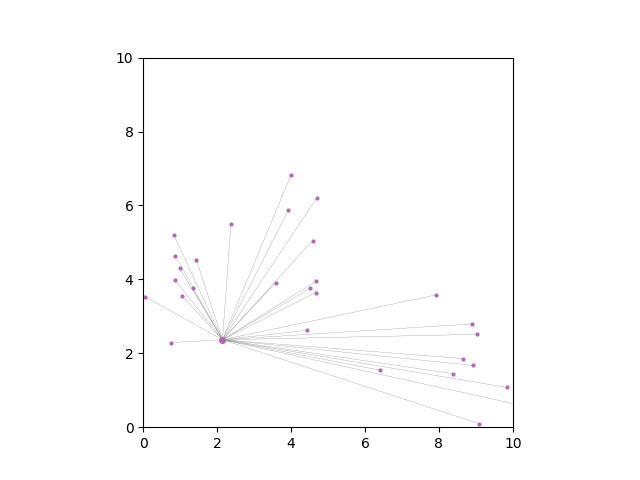
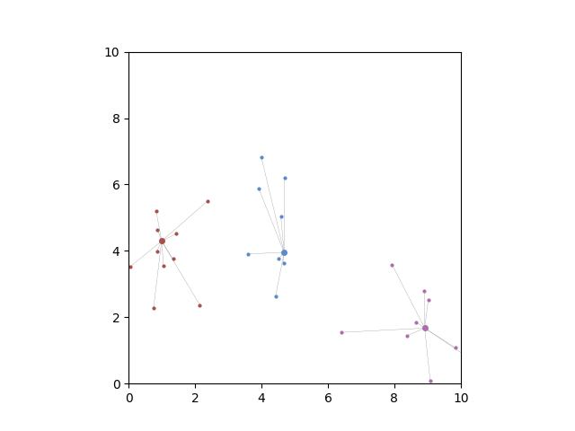

# multiobjective_optimization
A simple demo of the use of the square distance metric to jointly minimize 2 objectives in an Integer Linear Programming problem using [or-tools](https://github.com/google/or-tools). Based loosely on the concepts presented in this [paper](https://www.eng.buffalo.edu/Research/DOES/administrator/components/com_jresearch/files/publications/SMO-01-EK.pdf)

#### Background
A problem with competing objectives, such as clustering, involves two criteria which cannot be independently optimized without penalizing the score of each other.

The solution presented here finds the independent objective minima and then finds a solution which jointly minimizes the distance in 2D space from the (min_1,min_2) "utopia" point. 

For this demonstration, an extension of the clustering problem is presented, where the goal is to select a subset of "representative" datapoints to cover all points in the dataset with minimal distance.

Recommendations, questions, criticisms, discussion, etc. are welcome, please do not hesitate to open an issue or contact me.

## Building

At the moment this project is implemented in C++ and uses CMake to fetch and build or-tools from source. 
```
git clone https://github.com/rlorigro/multiobjective_optimization
cd multiobjective_optimization
mkdir build
cd build
cmake ..
make -j [n_threads]
```

## Usage

The demo only takes one optional argument, which is the seed used to generate a random dataset with 3 clusters in 2D space.
```
./demo [seed]
```

This will produce the following output files in the working directory:

CSVs corresponding to the independent and joint solutions:
```
edges_n.csv
edges_d.csv
edges_n_d.csv
nodes_n.csv
nodes_d.csv
nodes_n_d.csv
```

Simple PPM plots corresponding to the indpendent and joint solutions:
```
input_n.ppm
input_d.ppm
input_n_d.ppm
result_n.ppm
result_d.ppm
result_n_d.ppm
```

If you want to make a nicer plot (see example output), you can use the included python script:
```
python3 scripts/plot_results.py -n ./nodes_n_d.csv -e ./edges_n_d.csv
```

## Example output

Clusters are simulated using randomly centered normal dstributions in 2D. Then the optimizer attempts to minimize `n` and `d` for the problem of finding representative data points.

n = number of representatives (clusters)
d = total distance of representative to their constituents 

Larger dots are representatives
Smaller dots are constituents
Lines show which points are constituents of a representative
Colors correspond to clusters

### Min(d) solution
When **distance** is minimized independently, the model chooses almost the maximum number of representatives possible. Only several representatives have more than one child node.



### Min(n) solution
When **number of representatives** is minimized independently, the model selects only one representative.



### Joint solution
Jointly minimizing the distance from (n_min,d_min) yields a meaningful result which recreates the true clusters.


